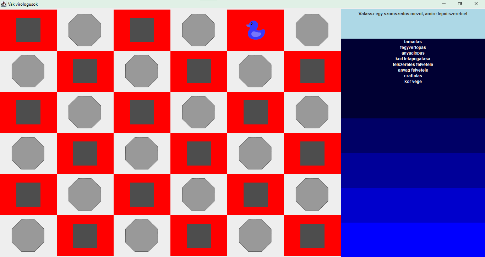

# Manuális tesztelés

    Ennek a dokumentációnak a szerepe, hogy rögzítse a felhasználói felület manuális tesztelésének folyamatát. A cél annak kiderítése, hogy az adott UI funkciók megfelelően működnek-e. Ehhez különböző tesztesetek kerültek megtervezésre és végrehajtása, melynek eredményét ezen dokumentáció rögzíti.

## 1. Kiinduló állapot

**_`Cél:`_** Annak ellenőrzése, hogy a játék indítása után megjelenik-e a játéktábla a megfelelő felállással. 

**_`Terv:`_**
- Elindítom a programot.
- Beírom a szövegdobozba, hogy hány játékossal szeretnék játszani.
- Rákattintok az indítás gombra.

**_`Végrehajtás:`_**

Megadtam, hogy 3 játékossal szeretnék játszani, majd megnyomtam az _Indít_ gombot.

Ezután az elvárásoknak megfelelően megjelent a játéktábla a mezőkkel, jobb oldalt a menüsávval, és az egyik mezőn megjelent az első játékoshoz tartozó kacsa.

## 2. Lépés a kacsával

**_`Cél:`_** Annak ellenőrzése, hogy tudok-e szomszédos mezőre lépni a kacsával. Az elvárt viselkedés, hogy a kacsa eltűnik arról a mezőről, amin állok, és megjelenik azon, amire kattintottam.

**_`Terv:`_**
- Rákattintok az egyik szomszédos mezőre.

**_`Végrehajtás:`_**

A kacsa helyzete a kattinktás előtt: 

A kacsa ezután valóban átkerült arra a mezőre, amelyikre kattintottam. Jobb oldalt felül megjelent a felirat, hogy _üres mezőre léptél_.

## 3. Kör vége

**_`Cél:`_** Annak ellenőrzése, hogy amikor rákattintunk a _kör vége_ menüpontra, eltűnik-e az aktuális játékos kacsája, és megjelenik-e az új játékos kacsája.
 
 **_`Terv:`_**
 - Rákattintok a jobb oldali menüsávban a _kör vége_ elemre.

  **_`Végrehajtás:`_**

  A kacsa helyzete kattintás előtt: 

  

  A kattintás után eltűnt a piros kacsa, és megjelent helyette egy kék színű, egy másik mezőn, mint ahol az előző tartózkodott. A menü fölött jobb oldalt eltűnt az _üres mezőre léptél_ felirat.

  

  ## 4. Medve ágens

   **_`Cél:`_** Bizonyos mezőkön medve ágens veszélye fenyegeti a játékost. Ha a játékos ellép egy ilyen mezőről, láthatóvá válik egy medve koponyája. Ennek a tesztnek a célja, hogy ellenőrizzem, a fertőzött mezőkön valóban megjelenik-e ez az ábra.

   **_`Terv:`_**
   - Kijelölök egy szomszédos mezőt, amelyikre át akarom léptetni a kacsát.
   - Ha a játékos nem arra a mezőre lépett, amire kattintottam, akkor tudhatom, hogy megfertőződött a medve ágenssel azon a mezőn, amelyik állt.

   **_`Végrehajtás:`_**

   A kék kacsa eredeti pozíciója:

   

   Ezután a mezőnek a baloldali szomszédjára kattintottam, de a kacsa nem oda került, hanem átlósan balra lefelé. Innen tudtam, hogy megfertőzödött a medve ágenssel. És az elvárásnak megfelelően azon a mezőn, amelyiken eredetileg állt, megjelent a medvekoponya.

   

   ## 5. Eszközök

   **_`Cél:`_** A játékban különböző eszközöket, kódokat és nyersanyagokat lehet gyűjteni. A cél annak ellenőrzése, hogy a jobb oldali sávban megjelennik-e a játékos eszköztárának tartalma.

   **_`Terv:`_**
   - Speciális mezőre lépve kiválasztom az oldalsó menüből azt a műveletet, amellyel a játékos eszköztárát újabb elemmel lehet bővíteni.
   - Ezt a lépést többször is megismétlem, és megnézem, hogy az adott játékos által eltárolt nyersanyagok, felszerelések és megtanult kódok megjelenítésre kerülnek-e a felhasználói felületen.

   **_`Végrehajtás:`_**

   A teszt végrehajtása során a jobb oldali sávban láthatóvá váltak az adott játékoshoz tartozó eszközök szöveges formában. 

   A képen látható az a játékállás, ahol a piros kacsának egy zsákja és egy kesztyűje van, valamint megtanulta a bénító ágens kódját.

   

   A sárga kacsának egy köpenye van, és két aminosava.

   

   ## 6. Több játékos ugyanazon a mezőn

   **_`Cél:`_** Annak ellenpőrzése, hogy ha több játékos ugyanazon a területen áll, akkor az összes kacsa megjelenik, amelyik az adott mezőn tartózkodik.

   **_`Terv:`_**
   - Lépéskor egy olyan mezőre kattintok, amiről tudom, hogy áll rajta egy másik játékos is. 

   **_`Végrehajtás:`_**

   A soron következő játékos a sárga kacsa volt, és tudtam, hogy a fölötte lévő mezőn tartózkodik a kék kacsa, így oda kattintottam. Lépés után mindkét kacsa láthatóvá vált az adott mezőn.

   

   Amikor a piros kacsa következett, azzal is erre a mezőre léptem. Az elvártnak megfelelően mindhárom kacsát kirajzolta a program.

   

   ## 7. Speciális mezők kirajzolásra

   **_`Cél:`_** A játék során nem csak üres mezők vannak, hanem előfordulnak bizonyos speciális mezők. Ezek csak akkor lesznek láthatóak, ha a kacsa ellép onnan. A cél annak ellenőrzére, hogy a program valóban kirajzolja-e ezeket a mezőket.

   **_`Terv:`_**
   - Amikor egy bizonyos speciális mezőn állok, akkor ezt kiírja a program a jobb felső sarokban.
   - Ha ellépek erről a területről, láthatóvá kell válnia az adott speciális mezőre jellemző ábrának.

   **_`Végrehajtás:`_**

   Az óvóhely jele egy piros sátor:

   

   A labor jele egy kék kémcső:

   

   A raktár jele metaforikusan egy adatbázisokat jelképező ikon:

   

   ## 8. A játék vége

   **_`Cél:`_** Annak tesztelése, hogy a felhasználói felület tudatja-e a felhasználóval, ha a játékot az egyik játékos megnyerte, és így az véget ért.

   **_`Terv:`_** 
   - A játék vége felállás kialakításához a kódban megadtam nyertesnek az első játékost, és meghívtam az End() függvényt.
   - Ezután elindítok egy játékot két játékossal.
   - Az első játékossal egy szomszédos mezőre lépek.
   - Rákattintok a _kör vége_ panelre.

   **_`Végrehajtás:`_**

   Mivel az első játékos a kód alapján megnyerte a játékot, a kör befejeztével az elvárásaimnak megfelelően a jobb felső sarokban megjelent a felirat, ami tudatja a felhasználóval, hogy véget ért a játék.

   

   ## 9. Invalid input 

   **_`Cél:`_** A játékot legalább kettő és legfeljebb nyolc játékos játszhatja. A teszt célja annak ellenőrzése, hogy a felhasználó a játék indításakor nem tud ezen az intervallumon kívül eső értéket megadni a játékosok számának.

   **_`Terv:`_**
   - Elindítom a játékot.
   - Beírom a szövegdobozba, hogy egy játékossal szeretnék játszani.
   - Rákattintok az _Indít_ gombra.

   **_`Végrehajtás:`_**

   Hiába nyomtam meg az egyes gombot, a szövegdoboz üres maradt. Invalid inputot ezért nem lehet bevinni a programba.

   

   ## 10. Bejárt mezők

   **_`Cél:`_** A játék során a játékos számára csak azokon a mezőkön tudja, hogy mi van, amelyeken már járt. A cél annak ellenőrzése, hogy ez valóban így van-e.

   **_`Terv:`_**
   - Elindítom a játékot.
   - A játékosokkal lépéseket teszek.
   - Ellenőrzöm, hogy csak azokat a mezőket látják-e, amelyeket már bejártak.

   **_`Végrehajtás:`_**

   A játék indítása után az összes mező szürke, mert még sehol nem járt a kacsa.

   

   A játék előrehaladtával, ahogy a játékos egyre több mezőt bejárt, a program máshogyan rajzolja ki a már meglátogatott mezőket, mint az ismeretleneket. Ha az adott mező üres volt, akkor eltűnteti róla a szürkeséget. A speciális mezőkön kirajzolja a megfelelő ikonokat. 

   

   ## Értékelés
    A program felhasználói felülete az elvártaknak megfelelően működött. 
    A felhasználó megfelelően meg tudja adni a játékosok számát. 
    A program kirajzolja a térképet, megjeleníti a mezőket. Megkülönbözteti azokat a mezőket, ahol a játékos már járt, azoktól, ahol még nem. 
    Kirajzolja a kacsákat. Mindig csak az aktuális játékos kacsája látható a képernyőn.
    A játékos eszköztárába tartozó elemeket megjeleníti a jobb oldali panelen.
    A jobb felső sarokban megfelelő információkkal látja el a játékost arról, hogy éppen hol tartózkodik, és hogy mik a lehetséges teendői (elvégez valamilyen műveletet, vagy átlép egy szomszédos mezőre). 
    A játék végét a program egyértelműen jelzi a felhasználó számára.

