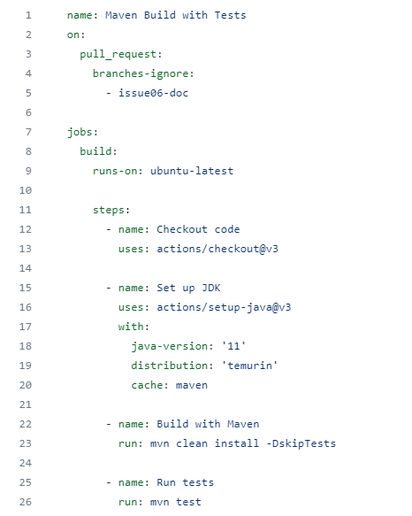
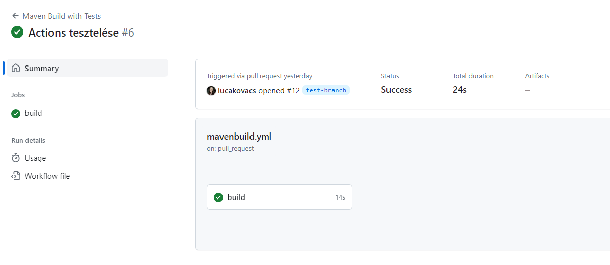

# Feladat: CI beüzemelése           

**A feladatot végezte:** Kovács Luca Ágota  

**GitHub issue:** [GitHub issue link](https://github.com/BME-MIT-IET/iet-hf-2023-csapat1000/issues/2)  


---

## 1.) Feladat leírása
Ebben a feladatban a GitHub Actions beüzemelése volt a cél. A CI támogatással azt szerettük volna elérni, hogy a 
felpusholt módosításaink, megnyitott ```Pull Request```-jeink automatikusan ellenőrizve legyenek és elkerüljük a 
törött branch-eket a projektben.

Ennek keretein belül olyan CI-t valósítottunk meg, amely minden ```Pull Request``` nyitásra lefut és az alábbi 
Maven parancsokat futtatja le:
- ```mvn clean install -DskipTests``` 
- ```mvn test``` 

A két Maven goal-t azért vettük külön és tettük 2 lépésbe, hogy a log-ok böngészése nélkül is jól elkülöníthető legyen,
hogy melyik fázisban van a hiba.

---

## 2) Feladat megvalósítása

### 2.1) YAML fájl létrehozása

A **GitHub Actions** használatához szükség volt egy YAML fájlra melyet a ```.github/workflows``` mappában kellett
elhelyezni. 

A mi jobunkat triggerelő fájl ```mavenbuild.yml``` néven hoztam létre, és tartalma az alábbiakban látható:


  
A YAML fájl tartalmát az alábbiakban szeretném ismertetni:

```name: Maven Build with Tests``` 

a futattandó job neve, mely jelen esetben *Maven Build with Tests* 

```yaml
  on:
  pull_request:
    branches-ignore:
      - issue06-doc 
  ```

Ebben a részben definiáltam, hogy a CI a ```pull request```-ekre fog lefutni. Ez minden branch-re érvényes kivéve az
```issue06-doc``` branch-et mert azon csak a dokumentációt írjuk. Ezt a kivételt a ```branches-ignore```-al tudtam
definiálni.

```yaml
jobs:
  build:
    runs-on: ubuntu-latest

    steps:
      - name: Checkout code
        uses: actions/checkout@v3

      - name: Set up JDK
        uses: actions/setup-java@v3
        with:
          java-version: '11'
          distribution: 'temurin'
          cache: maven
```

A fenti beállítással létrehoztam egy job-ot ```build``` névet, majd az első két lépésben (```Checkout code``` és
```Set up JDK```) definiáltam/beállítottam a futtatókörnyezetet amiben a job fog funti. A mi projektünkben JDK 11-et
használunk és disztribúciónak az *Eclipse Temurin JDK*-t választottuk.

```yaml
    - name: Build with Maven
      run: mvn clean install -DskipTests

    - name: Run tests
      run: mvn test
```

Az fentiekben két lépést definiáltam. Az első lépéssel a projektet build-eljük a ```mvn clean install -DskipTests``` 
paranccsal. 

A második lépésben a teszteket futtatjuk a ```mvn test``` parancs kiadásával.

Ezt azért vettem külön, hogy ha az Actions tab-ra megyünk, akkor a logok böngészése nélkül is könnyen be
tudjuk azonosítani melyik lépésben/hol volt a hiba. 

### 2.2) A CI működésének a tesztelése

A megírt CI működését nagyon egyszerűen tudtuk tesztelni. Mivel folyamatosan dolgoztunk különböző issue-kon keletkeztek
pull request-ek ahol már lefutott job.

Erről egy példa az alábbiakban látható: 




### 2.3) Eredmények, további teendők

A CI segítségével felfedtünk egy hibát a Maven beüzemelése kapcsán, ami a nem megfelelő JDK verzió használata volt.
Ezt a build error-ok segítségével nagyon könnyen ki tudtuk javítani.