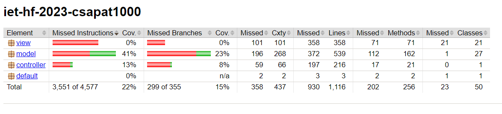

# Feladat: Code Coverage ellenőrzése

**A feladatot végezte:** Kovács Judit

**GitHub issue:** [GitHub issue link](https://github.com/BME-MIT-IET/iet-hf-2023-csapat1000/issues/20)


---

## 1.) Feladat leírása

A feladatom a projektünk kódlefedettségének a vizsgálata volt. Ezt a JaCoCo Java Code Coverage Library segítségével
oldottam meg. 

A feladat elvégzése során ezt a library-t hozzá kellett adnom a Maven projektünkhöz majd ezt el kellett kellett indítanom,
hogy megnézzem a megírt unit tesztjeimmel mekkora lefedettséget értem el.

---

## 2) Feladat megvalósítása

### 2.1) JaCoCo hozzáadása a projekthez

A JaCoCo-t a pom.xml-ben kellett hozzáadni a projekthez, mint egy új plugin. A hozzáadáshoz az alábbi sorokat illesztettem
be:

```xml
 <plugin>
    <groupId>org.jacoco</groupId>
    <artifactId>jacoco-maven-plugin</artifactId>
    <version>0.8.8</version>
    <executions>
        <execution>
            <goals>
                <goal>prepare-agent</goal>
            </goals>
        </execution>
        <execution>
            <id>generate-code-coverage-report</id>
            <phase>test</phase>
            <goals>
                <goal>report</goal>
            </goals>
        </execution>
    </executions>
</plugin>
```

### 2.2) A kódlefedettség ellenőrző futtatása

A kódlefedettség ellenőrzést az eddig megírt unit tesztekre futtattam le és az alábbi parancsot adtam ki:

```mvn clean install```

Ezzel lefordítottam a projektünket és lefutottak a tesztek is. A legenerált jelentést a target/site/index.html fájlban
találtam meg. Megnyitása után az aktuális állapot ez volt:




### 2.3) Eredmények, további teendők

A kódlefedettség vizsgálatakor azt tapasztaltam, hogy a model package-en kívül elég kis lefedettséget értem el, így a
továbbiakban igyekszem ezt minnél jobban növelni.