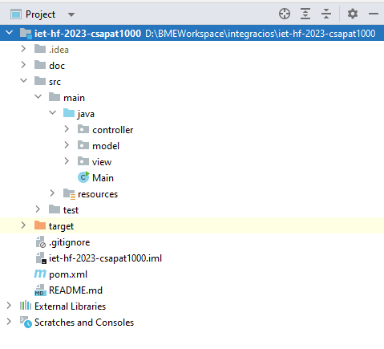

# Feladat: Maven beüzemelése

**A feladatot végezte:** Kovács Luca Ágota  

**GitHub issue:** [GitHub issue link](https://github.com/BME-MIT-IET/iet-hf-2023-csapat1000/issues/1)  

**Review:** Kovács Judit  

---

## 1.) Feladat leírása
Ebben a feladatban a projekt laboratórium tárgy keretein belül elkészített feladathoz üzemeltünk be egy build rendszert. 
A választásunk a **Maven**-re esett, mert az általunk használt IDE is jól támogatja.  

Minden Maven projekt rendelkezik ún. ```groupID```-val és ```artifactID```-val. A mi projektünk adatai az alábbiak:
- **groupID:** com.csapat100
- **artifactID:** iet-hf-2023-csapat1000

---

## 2) Feladat megvalósítása

### 2.1) A kódbázis könyvtárszerkezetének átalakítása

Mivel a Maven-nek egy meghatározott könyvtárszerkezete van, így a projektünket ehhez kellett igazítani.  

A feladat megoldása után, a végleges könyvtárszerkezet az alábbi módon néz ki:

  
A képi erőforrásokat áthelyeztük a ```resources``` mappába, ami szükségessé tett némi kódváltoztatást. 
Ezeket a kódváltoztatásokat minden elérési út hivatkozásnál elvégeztük.

### 2.2) Maven működésének a tesztelése

Miután a könyvtárszerkezetet módosítottuk és a projekt ```pom.xml``` fájljában definiáltuk az adatokat, a csapat
minden tagja pull-olta az elkészült megoldást a saját lokális git repo-jába, majd lefordította azt. Ez szerencsére
mindenkinek sikerült, így a build rendszer beüzemelése sikeres volt.

A projektünk az alábbi Maven paranccsal fordítható a tesztek futtatása nélkül:  

```mvn clean install -DskipTests``` 

### 2.3) Eredmények, további teendők

A Maven beüzemelése gond nélkül sikerült, mindenkinek sikerült fordítani a projektet. Ebben a feladatban még nem 
készültek tesztek, illetve nem használtunk semmilyen plusz dependenciát, ezeket a más, további issue-kban fogjuk
megtenni.