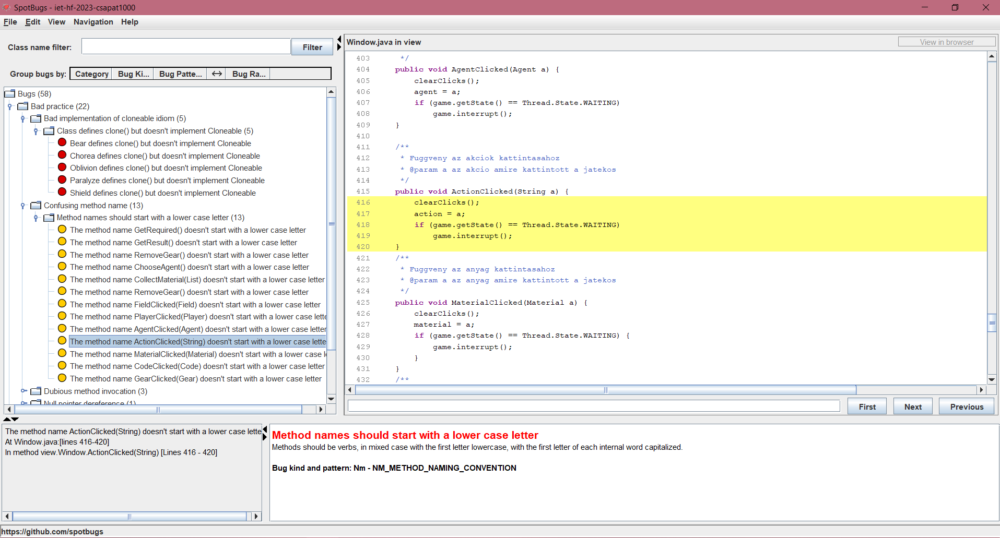
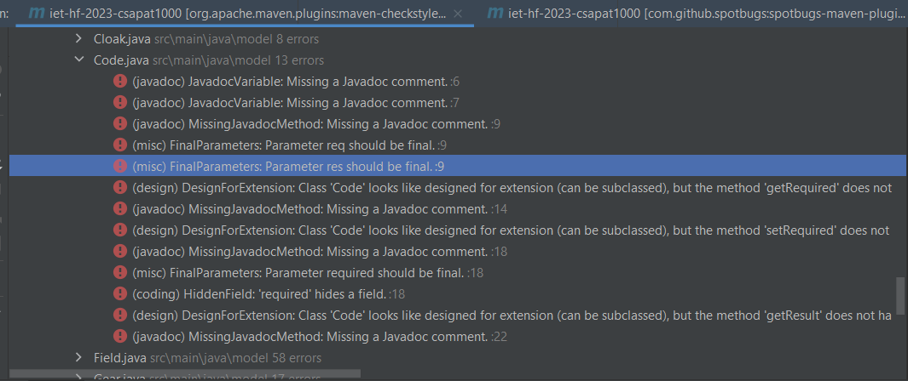

# Statikus kód analízis

 **Feladatot végezte:** Kolozsvári Lilla

 **GitHub issue:**   [SpotBugs](https://github.com/BME-MIT-IET/iet-hf-2023-csapat1000/issues/18), [CheckStyles](https://github.com/BME-MIT-IET/iet-hf-2023-csapat1000/issues/24)

 **Review:** Kovács Luca Ágota

## 1.) Feladat leírása:

Statikus analízis eszköz futtatása és jelzett hibák átnézése (SpotBugs, CheckStyle). Nem triviális hibák javítása.

## 2.) Feladat megvalósítása:

### 2.1.) SpotBugs részfeladat
A SpotBugs statikus kódanalizáló plugint felvettem a pom.xml fájlba a plugins tagek közé. 

A plugin-t a maven segítségével futtattam, melynek eredménye a kódban található hibák listája volt. Egy grafikus felületre átnavigálva áttekinthetőek voltak a hibák.

 

A fentebbi képen látható hibák javításra kerültek. A függvényneveket kisbetűssé tettem a model osztályokban, a hozzáadtam default ágat a switch statementhez, ahonnan hiányzott és további hibákat javítottam, amiket a commitokban javítottam.

### 2.2.) CheckStyle részfeladat
A kódolási stílust ellenőrző plugin-t használtam a kódbázis statikus vizsgálatára.

Ezt a plugint is a pom.xml-ben vettem fel, majd a maven segítségével futtattam.

Több stilisztikai találatot javítottam a Game osztályban, többek között a JavaDoc-ra vonatkozókat.

Az alábbi képen a  hibák jelzése látható.

 

### 2.3) Eredmények, további teendők

Több hiba is maradt a projektben, amiket idő hiány miatt, vagy amiatt, mert hibás találat volt, toleráltam.
