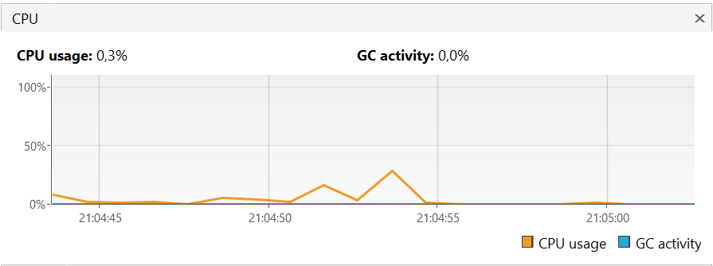

# Stressztesztelés

    A stressztesztelés a teljesítménytesztelés egy formája, amely egy rendszer stabilitását és robusztusságát értékeli szélsőséges vagy kedvezőtlen körülmények között. Célja annak felmérése, hogy a rendszer képes-e kezelni a nagy terhelést, a nagy forgalmat vagy az erőforrás-igényes forgatókönyveket. A stressztesztelés elsődleges célja a rendszer teljesítményének meghatározása és a stresszhelyzetben esetlegesen felmerülő szűk keresztmetszetek vagy gyengeségek azonosítása. Ez az információ segít a skálázhatóság tervezésében, a stabilitás biztosításában és a rendszer hibatűrő képességének javításában.

## 1. Célom

Szeretném a programot letesztelni először magában, hogy milyen erőforráshasználattal rendelkezik futás közben.  
Milyen komponensei használják a legtöbb teljesítményt.

Ezután ki szeretném tenni különböző típusú teszteseteknek, amelyek szimulálják a játék egyes lépéseit.

Ezeket a teszteket végül megsokszorozom, hogy szimuláljam a terhelés növekedését, megnézve, hogy erre hogyan reagál a játék erőforrás-igényessége, illetve stabilitása.

## 2. Felhasznált programok

A kitűzött céljaim elvégzéséhez kerestem az interneten programokat, amelyek képesek ezen feladatok megvalósítására.

### **Apache JMeter** 

> A JMeter egy nyílt forráskódú teljesítménytesztelő eszköz, amelyet az Apache Software Foundation fejlesztett ki. Széles körben használják webes alkalmazások, API-k és más típusú szoftverrendszerek terhelés- és stressztesztelésére, valamint teljesítménymérésére. A JMeter lehetővé teszi különböző forgatókönyvek szimulálását és az alkalmazás teljesítményének elemzését különböző terhelések mellett.

Egy különálló program, aminek letöltése utána futtatható GUI vagy konzolos módban is.

Ezzel fogom elvégezni az automatizált tesztek futtatását, hogy azok sokszorozhatók legyenek ezzel szimulálva a terhelés megnövekedést és a stressztesztet.

### **Visual VM**

>A VisualVM egy hatékony és sokoldalú profilkészítő és felügyeleti eszköz Java alkalmazásokhoz. Az Oracle által kifejlesztett, ingyenes és nyílt forráskódú eszköz. A VisualVM gazdag funkciókészletet biztosít a helyi és távoli gépeken futó Java-alkalmazások teljesítményének és erőforrás-felhasználásának elemzéséhez.

Szintén egy különálló program, aminek a segítségével fogom monitorozni a játék futása, illetve a stresszteszt közbeni erőforrás felhasználását a programnak.

**Ezen két program kombinációjával valósítottam meg a stressztesztelést.**

## 3. JMeter integrációja a Java projektbe

Ahhoz, hogy a JMeter szimulálni tudja a terhelést, szükség van speciális JMeter típusú Sampler osztályok létrehozására a projektben.

Ehhez először Maven-en keresztül beintegráltam a következő függőségeket a projektbe:
- ApacheJMeter_core
- ApacheJMeter_java

Ezek segítségével már képes voltam leszármaztatni a *javaRequestMove* osztályt az *AbstractJavaSamplerClient*-ből.

Ez az első teszt, amiben csak a játékos mezőváltoztatását szimulálom.

Ezek után az egész projektet kikonvertálnom egy JAR fájlba.

A Maven függőségek miatt, ezt viszont nem tudom elvégezni az IDE-be épített eszközök segítségével.

Ennek megoldására Maven-en keresztül beintegráltam a *maven-assembly-plugin*-t, aminek segítségével már képes lettem elkészíteni egy olyan JAR fájl-t, amiben a teljes projekt működőképes állapotban van.

Ezt a JAR fájlt behelyezve a JMeter *apache-jmeter-5.5\lib\ext* elérési úttal rendelkező mappájába már látható a tesztelni kívánt osztály a program újraindítása után.

## 4. JMeter tesztelés

A *javaRequestMove* osztály projektbe illesztése után az elkészített *iet-hf-2023-csapat1000-1.0-SNAPSHOT-jar-with-dependencies.jar* fájlból felismeri a JMeter a tesztelendő javaRequestMove-ot.

Létrehoztam egy Thread Group-ot, amibe pedig behelyeztem egy Java Request Sampler-t.

Ebben a Sampler-ben el tudom érni a *stresszteszt.javaRequestMove* osztályt.

A Thread Group-ban beállítható, hogy hány szálból hívja meg a stresszteszt alatt.  
Ezt pontosítani is lehet Ramp-up period megadásával, ami jobban szimulálja a folyamatosan beérkező terheléseket.  
A Loop count is állítható, hogy egy thread-ből hányszor legyen meghívva a teszt.

Végül pedig különböző Listener-ek is hozzáadhatók, amelyek mérik a teljesítményt a stresszteszt alatt.

Ezek használata ebben a projektben nem sok információval szolgál, mivel főleg web alapú, HTTP kérések tesztelésére lettek fejlesztve.

Én a programnak csak azt a funkcióját használom ki, hogy könnyen kezelhető benne testre szabni a terhelés mértéket.

## 5. VisualVM tesztelés

A program telepítése után először magának a játéknak az erőforrás felhasználását fogom monitorozni megszokott használat mellett.

Ez azt jelenti, hogy játszani fogok a játékkal közben pedig látni fogom a programban az ez által bekövetkezett terhelést a gépemen.

A CPU használat a játék futtatása közben:

Ahogy látható erős ugrások és szakadások vannak benne, ekkor a grafikus felület válaszára kell várnunk.

A Heap-en használat memória mennyisége az idő folyásával:

Szintén megfigyelhető a periodikusan megnövekedő majd lecsökkenő erőforrás használat.

Használat osztályok száma:

Ezek száma nagyrészt konstans marad a játék futása közben.

A futtatott szálak száma:

Ezek száma kisebb változásoktól eltekintve viszonylag egy tartományban marad.

A szálak részletesebben is megfigyelhetők:

Köztük vannak a már nem aktív szálak is, ezek a képek meghívására voltak alkalmazva.

Mellettük látszik, hogy melyik mennyi ideig volt használva.

Az egyes metódusok CPU használata:

A legtöbb CPU használata a *view.Window.mapUpdateKorvege()* függvénynek van.
Ezen belül is a Swing *setImage* függvénye használja a CPU idő 36,6%-át.

Ekkore a program kicseréli a képeket aszerint, hogy éppen melyik kacsával rendelkező játékos következik, illetve, hogy mennyit ismer a térképből.

A második és harmadik a *controller.Game.getAction()* függvénye, illetve a *controller.Game.getField()* 29,5%-al és 28%-al.

Ezeknél igazából az input-ra vár a program.

Még a *controller.Game.mapUpdate()* használ figyelemre méltó CPU időt.

## 6 Kombinált/Stressz tesztelés

Így, hogy mindkét programot sikerült használni külön-külön, megvalósítom a kombinált használatuk a valódi stresszteszteléshez.

Először kezdek 10 szállal: 

Ennek eredményeképp a következő statisztikát láttam:

A képen jelölt CPU használatot idézte elő ez a stressz teszt konfiguráció.

Következőnek megnövelem 100-ra a szálak számát:

Ekkor már több mint 25%-os CPU kihasználtság lép fel.

1000 majd 10.000 szál:

Létrehoztam 3 másik Thread Group-ot, mindegyikben 1000 szál fut, de el vannak választva egymástól 3 másodperces Ramp-up time segítségével.

Ennek a tesztnek hatására látszik a terhelés növekedés:

Ezzel elvégeztem a játék stressztesztelését.

## 7 Konklúzió

A stressztesztelést elvégzésének folyamata közben sok hasznos dolgot tanultam mind a program egyéni részeiről, mind az ehhez használt keretrendszer használatáról.

A JMeter beüzemelése meglepően sok időt vett igénybe a Maven komplikáció miatt.
Ezen kívül viszont könnyen tanulható én intuitív volt a program használata.

A VisualVM telepítése, beüzemelése és használata is nagyon egyszerű volt.
Nagyon sok monitorozható tulajdonságát ismertem meg a programnak.

A stressztesztelés hatására meg tudtam állapítani, hogy a program a grafikus megjelenítés hatására tölt sok időt az egyes játékosok körei között.